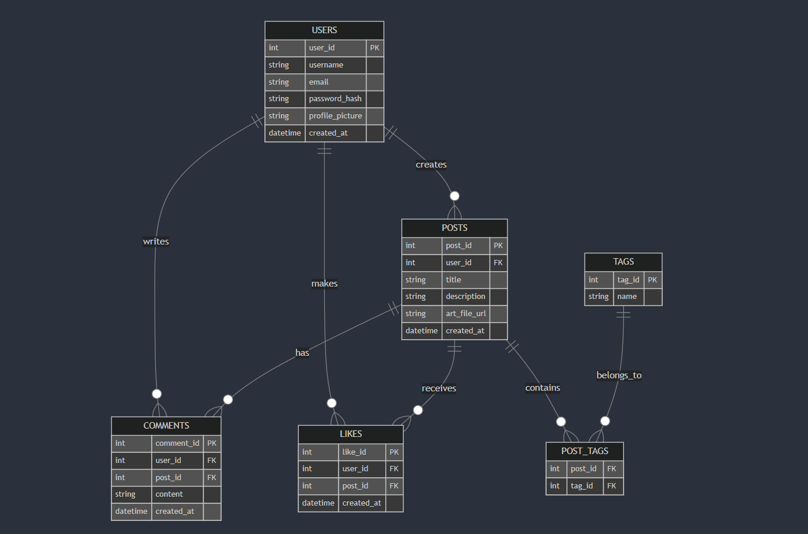

# 3D Platform

A platform for 3D artists with a React frontend and Express backend.

## Project Links & Access

### GitHub Repository

https://github.com/adamgiebl/3d-platform

### Back4App Database

https://backend.back4app.com/apps/b92fc584-780c-4f3a-bb6f-f6a643858a17/browser

## Data Model

### ER Diagram



## Prerequisites

- Node.js (v18 or higher recommended)
- npm or yarn

## Setup & Running

### Server

```bash
cd server
npm install
npm run dev
```

The server will run on `http://localhost:3000` by default.

### Client

```bash
cd client
npm install
npm start
```

The client will run on `http://localhost:3001` and automatically open in your default browser.
